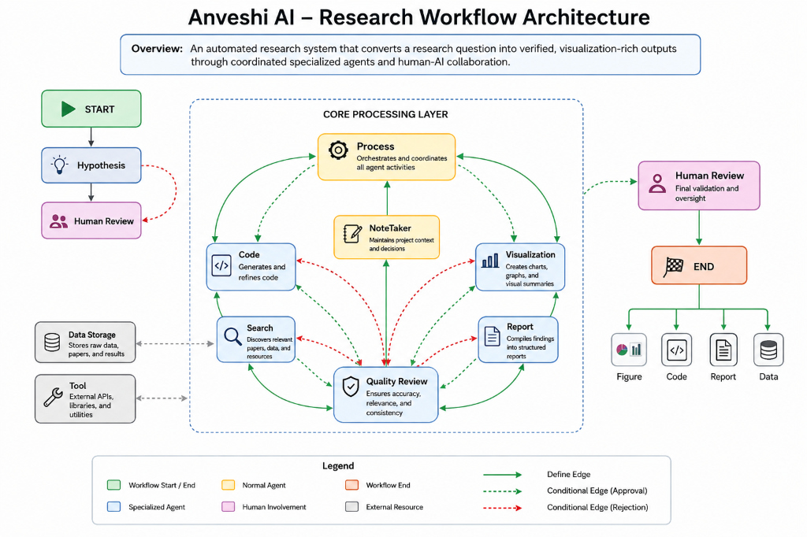
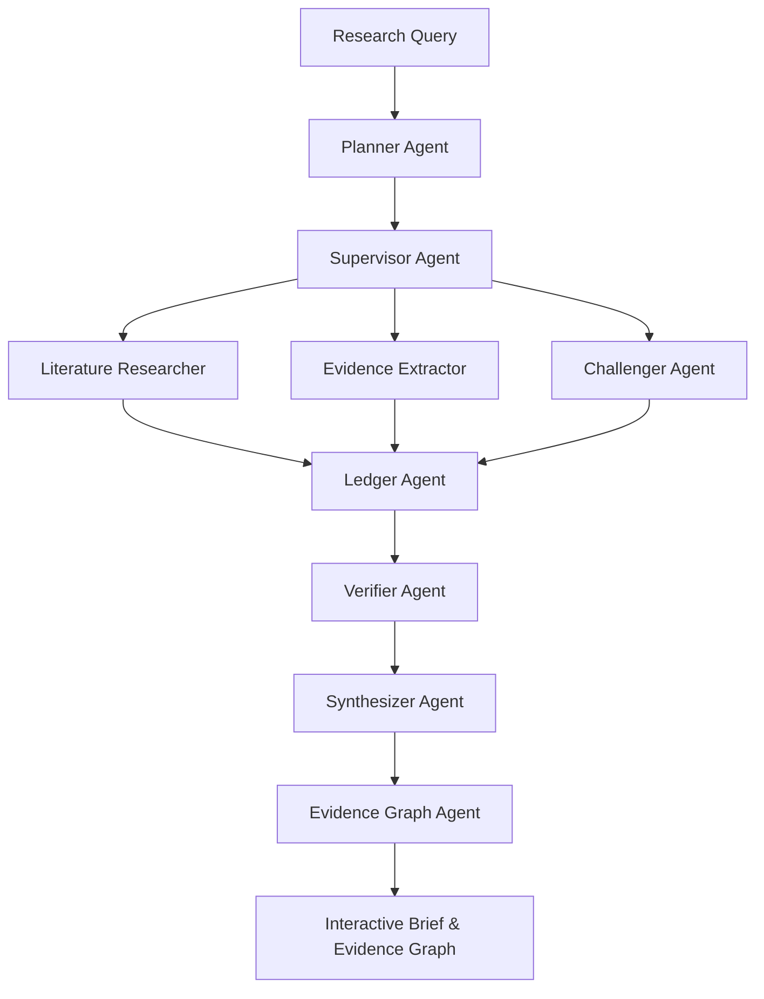

# Anveshi AI — Multi-Agent Evidence-Grounded Research Engine

[](LICENSE)
[](https://nextjs.org/)
[](https://fastapi.tiangolo.com/)
[](https://www.python.org/)
[](https://supabase.com/)

**Anveshi AI** is an advanced multi-agent research platform designed to automate literature search, evidence extraction, contradiction detection, and report synthesis through coordinated specialized AI agents and human-AI collaboration.

---

## 📐 System Architecture



The system transforms raw research queries into verified, visualization-rich outputs through a multi-agent processing pipeline:



---

## ✨ Key Features

### 🤖 Multi-Agent Processing Pipeline
- **Planner Agent**: Deconstructs complex research questions into structured sub-hypotheses and query plans.
- **Supervisor Agent**: Manages state transitions and orchestrates parallel agent dispatch.
- **Literature Researcher**: Discovers relevant academic papers, preprints, and verified web sources.
- **Evidence Extractor**: Extracts atomic claims, methodology notes, and direct excerpt citations.
- **Challenger Agent**: Actively searches for opposing/contradictory evidence to eliminate confirmation bias.
- **Ledger Agent**: Maintains a centralized claims repository and tracks evidence grounding scores.
- **Verifier Agent**: Runs automated checks (`Source Citation`, `Factual Grounding`, `Error Analysis`) marking claims as `PASS`, `FAIL`, or `UNCERTAIN`.
- **Synthesizer Agent**: Compiles executive briefs, key findings, and methodology summaries into markdown reports.
- **Evidence Graph Agent**: Constructs directional node-edge evidence networks.

### 📊 Real-Time Interactive UI & Export
- **Live Canvas Execution**: Visualizes agent execution flow step-by-step using interactive node graphs.
- **Interactive Evidence Graph**: Explore paper-to-claim and contradiction relationships interactively.
- **One-Click Clean Export**: Export full research briefs to clean, print-styled PDF documents or raw Markdown.
- **Saved Reports & Runs**: Access historical runs, view verification breakdowns, and restart past investigations.

---

## 🛠️ Technology Stack

| Layer | Technologies |
|---|---|
| **Frontend** | Next.js 16 (App Router), React 19, TypeScript, Vanilla CSS, XYFlow (ReactFlow), Lucide Icons |
| **Backend** | Python 3.10+, FastAPI, LangChain, LangGraph, Uvicorn |
| **Database & Auth** | Supabase PostgreSQL |
| **Search & Scraping** | Tavily Search API, DuckDuckGo, Firecrawl / fastCRW |
| **LLM Support** | OpenAI (GPT-4o / GPT-4o-mini), Anthropic (Claude), Google (Gemini) |

---

## 🚀 Quick Start

### 1. Clone the Repository
```bash
git clone https://github.com/786AdiPY/Anveshi-AI.git
cd Anveshi-AI
```

### 2. Environment Setup

Copy `.env Example` to `.env`:
```bash
cp ".env Example" .env
```

Configure your API keys in `.env`:
```env
OPENAI_API_KEY=your_openai_api_key
TAVILY_API_KEY=your_tavily_api_key
NEXT_PUBLIC_API_URL=http://localhost:8000
```

### 3. Backend Setup
```bash
python -m venv .venv
source .venv/bin/activate  # On Windows: .venv\Scripts\activate
pip install -r requirements.txt
python -m src.api
```
*Backend runs on `http://localhost:8000`*

### 4. Frontend Setup
```bash
cd frontend
npm install
npm run dev
```
*Frontend runs on `http://localhost:3000`*

---

## ⚙️ Agent & Model Configuration

Customize language model providers and temperatures per agent in `config/agent_models.yaml`:

```yaml
agents:
  planner_agent:
    provider: openai
    model_config:
      model: gpt-4o-mini
      temperature: 0.7
  verifier_agent:
    provider: openai
    model_config:
      model: gpt-4o
      temperature: 0.2
```

---

## 📑 Documentation

- [System Architecture](docs/SYSTEM_ARCHITECTURE.md)
- [Agent Config Reference](docs/AGENT_CONFIG.md)
- [Tool Configuration](docs/TOOL_CONFIG.md)
- [Skill Configuration](docs/SKILL_CONFIG.md)
- [MCP Configuration](docs/MCP_CONFIG.md)

---

## 📄 License

Distributed under the MIT License. See `LICENSE` for details.

---

## 👤 Author

Developed by **[786AdiPY](https://github.com/786AdiPY)**.
